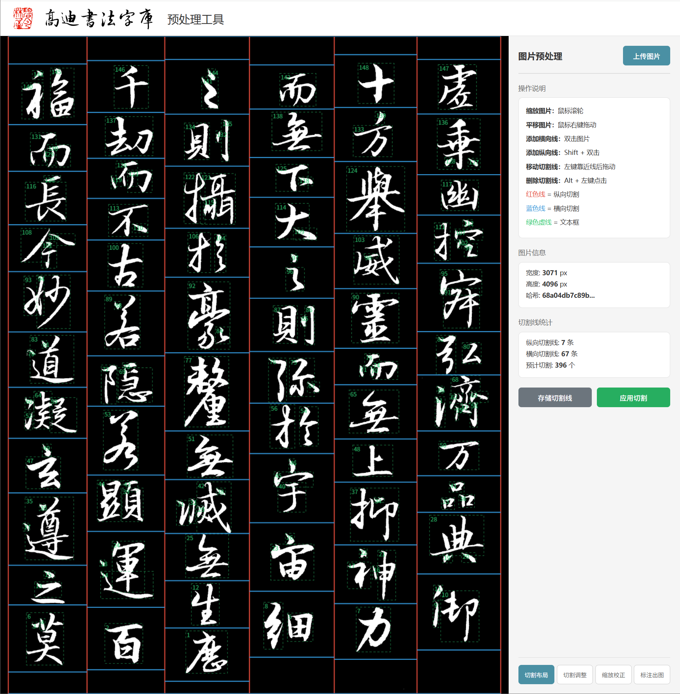

# 高迪 PDF 翻译工具

<p align="center">
  
</p>

本地化 PDF 全文翻译工具，面向学术论文和技术文档设计。优先适配本地大模型（Ollama），同时支持 OpenAI 兼容 API（DeepSeek、智谱等）。

## 为什么需要它

大型 PDF 全文翻译是常见需求，但学术文档包含大量不适合翻译的内容：公式、矢量图标注、参考文献、目录、附录等。通用翻译工具会破坏这些内容或丢失排版。

本工具在翻译前先解析 PDF 结构，智能识别并保护这些区域，只翻译正文段落，译文尽量与原文对齐。

## 功能

1. **智能内容保护** — 自动识别并跳过公式（LaTeX 数学字体、Unicode 符号）、矢量图区域（路径聚类检测）、参考文献（支持 `[1]`、`1.`、ACM/SIGGRAPH 三种引文格式）、目录、附录、Index
2. **双语对译** — 原文页与译文页交错排列，方便对照阅读；也支持下载纯翻译版
3. **多引擎支持** — Ollama 本地模型 / OpenAI 兼容 API（DeepSeek、智谱、任意兼容端点），Web 界面一键切换
4. **翻译缓存** — SQLite 缓存，相同段落不重复调用模型，支持"强制重翻"忽略缓存
5. **多线程并行** — 3/5/10 线程可选，大幅加速翻译
6. **排版对齐** — CJK 禁则处理、自适应字号缩放、多字体映射（衬线→宋体、无衬线→雅黑）、高度约束防溢出
7. **断点续传** — 页面级别进度跟踪，中断后可继续翻译
8. **轻量部署** — 仅依赖 Flask + PyMuPDF + requests，无需 Redis/Celery

## 与 BabelDOC 的区别

本工具受 BabelDOC 启发，借鉴了其排版算法和 API 设计思路，但有不同定位：

| | 本工具 | BabelDOC |
|---|---|---|
| 部署 | 本地单进程，`python app.py` | 需要 Docker 或较多配置 |
| 依赖 | Flask + PyMuPDF + requests | 较多 Python 包 |
| 界面 | Web UI（拖拽上传、实时进度） | 命令行为主 |
| 模型 | 优先本地 Ollama，兼容 API | 以 API 为主 |
| 缓存 | 内建 SQLite | 需额外配置 |

## 快速开始

```bash
# 安装依赖
pip install flask pymupdf requests

# 启动（默认端口 6500）
python app.py

# 浏览器访问
http://localhost:6500
```

## 配置

首次使用时在 Web 界面配置翻译引擎：

- **Ollama**：选择本地模型（如 `translategemma:27b`），确保 Ollama 服务已启动
- **OpenAI API**：填写 API Key、Base URL 和模型名（如 DeepSeek 的 `https://api.deepseek.com/v1`）

设置自动持久化，无需每次配置。

## 技术架构

```
pdf翻译/
├── app.py                      # Flask Web 服务
├── config.py                   # 配置
├── core/
│   ├── pdf_parser.py           # PDF 解析（文本块、图片、公式、参考文献检测）
│   └── pdf_rebuilder.py        # PDF 重建（翻译文本回写、排版、双语生成）
├── services/
│   ├── google_translate.py     # Ollama 翻译 + 公式保护
│   ├── openai_translate.py     # OpenAI 兼容 API 翻译
│   ├── translation_cache.py    # SQLite 翻译缓存
│   └── formula_detector.py     # 公式检测器
├── templates/
│   └── index.html              # Web 界面
└── data/
    └── cache/
        └── translation_cache.db
```

## 效果

<p align="center">
  
</p>

## License

MIT
